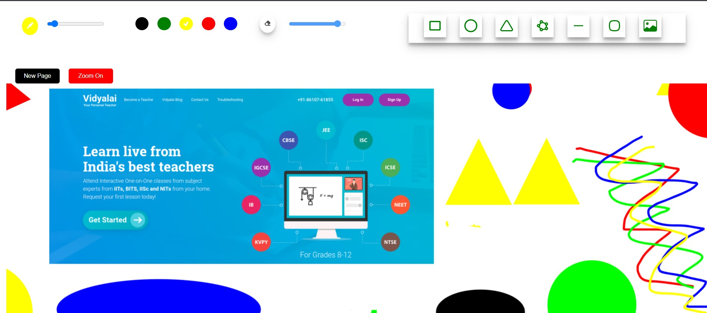

# Whiteboard App

The Whiteboard App is a web application that allows students to freely draw using different colors and pen sizes, as well as erase their drawings. It is built using React, HTML, CSS, and JavaScript, incorporating the Fabric.js library for enhanced canvas functionality.

## Features

The updated version of the Whiteboard App includes the following features:

- Free drawing with multiple colors and pen sizes
- Eraser tool to remove drawings
- Zoom control for easy navigation and precision drawing
- Addition of 6 different shapes for enhanced creativity
- Ability to insert and  image within the whiteboard
- Improved and visually appealing user interface

## Tech Stack

The Whiteboard App is built using the following technologies:

- React: A JavaScript library for building user interfaces
- Fabric.js: A powerful and easy-to-use JavaScript canvas library for enhanced drawing functionality
- JavaScript: A programming language that enables dynamic and interactive web content
- CSS: The language for styling HTML documents
